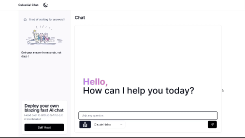

## CelestialChat

CelestialChat is a simple AI chat to deliver fast saerch results powered by Claude Haiku and Tavily search. 

## Todo

Scroll behavior, although with the speed of Claude, following the text might not offer optimal experience.

Include Image in the search results, I haven't find an Image search api that delivers results matching the answers.


## Getting Started

Set Up .env:

```bash
ANTHROPIC_API_KEY=
TAVILY_API_KEY=
OPENAI_API_KEY=

```

## Docker 

```bash
docker build -t celestialchat .
```

```bash
docker run -p 3000:3000 -d --name celestialchat-container celestialchat
```

## Stack

- Nextjs
- Lobe chat UI
- Shadcn UI
- Tavily search API


## Deployment

The easiest way to deploy is 

- [](https://vercel.com/new/clone?repository-url=https%3A%2F%2Fgithub.com%2Fsuzushi-tw%2Fcelestialchat&env=ANTHROPIC_API_KEY,TAVILY_API_KEY)

- [](https://cloud.digitalocean.com/apps/new?repo=https://github.com/suzushi-tw/celestialchat/tree/main&refcode=11745b6395ca)

- Cloudflare Pages (add Edge run time)


##  Artwork

Special thanks to all the artist for amazing artwork !
Artworks used in the project falls under their 利用規約,
which grants personal use and commercial use, however
the copy right belongs to the original author and shall
not be registered for trademark. 

- [ガーリー素材] (https://girlysozai.com/)


## License

Open source under MIT License, you are welcome to 

- Self host
- Make any modification 
- Commercialize it

In the case of commerical use, This License does not grant permission to use the trade names, trademarks, service marks, or product names of the Artwork and the Licensor. 

